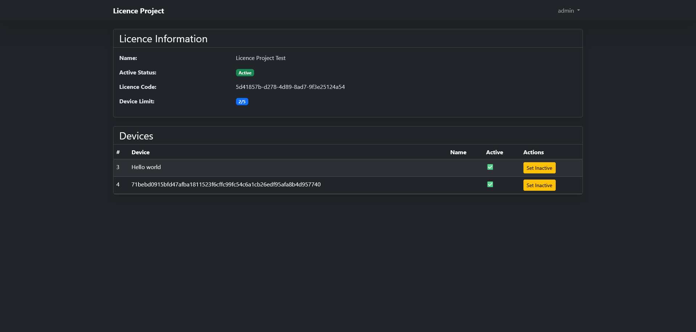

# License Management System

This project is a License Management System consisting of two main components: **Client** and **Server**. The Server component provides a web-based panel for managing licenses, while the Client component is a simple GUI application that validates license keys. The system is designed to be easily integrated into other projects, allowing developers to manage and validate licenses seamlessly.

## Table of Contents
- [License Management System](#license-management-system)
  - [Table of Contents](#table-of-contents)
  - [Introduction](#introduction)
  - [Images](#images)
  - [Features](#features)
  - [Installation](#installation)
    - [Server](#server)

## Introduction

The License Management System is designed to manage and validate software licenses. The Server component is built using PHP and provides a web interface for creating and managing licenses. The Client component, built using Python and Tkinter, allows users to validate their license keys against the server. The system is modular and can be easily integrated into existing projects.

## Images


\
\


## Features

- **Server:**
  - User authentication (username and password).
  - Create and delete licenses.
  - Specify the number of devices allowed per license.
  - Store device details associated with each license.
  - Generate unique license keys using UUID.

- **Client:**
  - Simple GUI for license key validation.
  - Sends license key to the server for validation.
  - Displays validation result (valid/invalid).
  - Easy to integrate into existing Python projects.

## Installation

### Server

1. Clone the repository:
   ```bash
   git clone https://github.com/Bildeniz/Licence-Project.git
   ```
2. Run the server
    ```bash
   cd Licence-Project/Server
   composer install
   php -S localhost:80
   ```
   Default User:\
   Username: admin\
   Password: 123456789
3. Run UI or integrate your project:
    ```bash
    cd Licence-Project/Client
    python -m pip install -r requirements.txt
    python main.py
    ```